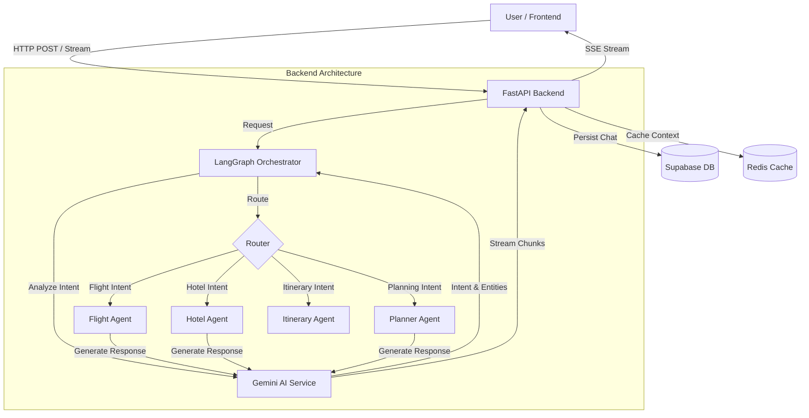

# Project Title: Orbis AI - Intelligent Multi-Agent Travel Planning System

**FYP– I REPORT**
**BS(CS) Fall 2025**

**Name:**
M.Talha Yousif
22k-5146

**Name:**
 Salik Ahmed Bhatti
22k-5114

**Name:**
Toheed Ali
22k-4027

**Supervisor:** Ms. Bakhtawar Abbasi
**Co-supervisor:**  _NONE_

**Department of Computer Science**

**FAST-National University of Computer & Emerging Sciences, Karachi**

---

## Contents

1. **Introduction**
2. **Methodology**
   - Development Approach
   - System Architecture
   - Data Collection & Evaluation
3. **Testing and Results**
4. **System Diagram**
5. **Goals For FYP-II**
6. **Conclusion**
7. **References**

---

## 1. Introduction

Orbis AI is an advanced, AI-powered travel planning platform designed to revolutionize how users organize their trips. Unlike traditional travel booking sites that offer static listings, Orbis AI leverages a multi-agent architecture to provide personalized, dynamic, and context-aware travel itineraries. The system integrates flight search, hotel booking, and itinerary management into a cohesive conversational interface, powered by Large Language Models (LLMs) and sophisticated orchestration logic.

The primary objective of FYP-I was to establish the core infrastructure, implement the multi-agent orchestration layer using LangGraph, and create a responsive, streaming-enabled frontend interface.

## 2. Methodology

### Development Approach
The project follows an Agile development methodology, characterized by iterative development cycles. This approach allowed for continuous integration of features, immediate feedback loops, and rapid adaptation to technical challenges (e.g., switching from simple orchestration to LangGraph).

### System Architecture

The system is built on a modern, scalable tech stack:

*   **Frontend:**
    *   **Framework:** Next.js 15 (React) for server-side rendering and static site generation.
    *   **UI Library:** Radix UI and Tailwind CSS for a responsive, accessible design.
    *   **State Management:** React Query for efficient server state management and caching.
    *   **Streaming:** Custom hooks (`useChatStream`) for handling Server-Sent Events (SSE) to provide real-time AI responses.

*   **Backend:**
    *   **API Framework:** FastAPI (Python) for high-performance asynchronous endpoints.
    *   **Orchestration:** **LangGraph** (StateGraph) for managing complex multi-agent workflows. This replaces linear logic with a graph-based approach allowing for conditional routing, loops, and state persistence.
    *   **AI Engine:** Google Gemini (via `google-generativeai` SDK) for intent analysis and natural language generation.
    *   **Database:** **Supabase (PostgreSQL)**. We utilize Supabase as our primary relational database to store:
        *   **User Profiles:** Authentication data and user preferences.
        *   **Conversations:** Persistent chat history with role-based messages (user/assistant).
        *   **Itineraries:** Structured travel plans, bookings, and saved trips.
        *   **Vector Embeddings:** (Planned) For semantic search and RAG (Retrieval-Augmented Generation) capabilities.
    *   **Caching:** Redis for session management and caching frequent queries.

### Key Components Implementation

1.  **LangGraph Orchestrator:**
    *   Implemented a `StateGraph` that defines the flow of conversation.
    *   **Nodes:** Orchestrator (Entry), Flight Agent, Hotel Agent, Planner Agent, Itinerary Agent, Booking Agent.
    *   **Edges:** Conditional routing based on intent analysis (e.g., "Book a flight" -> Flight Agent).

2.  **Streaming Infrastructure:**
    *   Moved from standard HTTP responses to **Server-Sent Events (SSE)**.
    *   Implemented manual chunking and streaming in `chat_stream.py` to ensure users see the AI "typing" in real-time, improving perceived latency.

3.  **Comprehensive Logging:**
    *   Integrated `structlog` for structured, JSON-formatted logs.
    *   Separate log files for different concerns: `ai_interactions.log`, `database.log`, `api_requests.log`.

### Data Collection & Evaluation
*   **Data Sources:** Real-time data simulation for flights and hotels (mocked for Phase 1, to be integrated with Amadeus/Sabre APIs in Phase 2).
*   **Evaluation Metrics:**
    *   **Response Latency:** Time to first token (TTFT).
    *   **Intent Accuracy:** Percentage of user queries correctly routed to the specialized agent.
    *   **System Stability:** Error rates during concurrent chat sessions.

## 3. Testing and Results

### Testing Strategy
*   **Unit Testing:** Manual test scripts (`tests/manual/`) were created to verify individual components like the Gemini service and database connections.
*   **Integration Testing:** Verified the end-to-end flow from the Next.js frontend to the FastAPI backend and back via SSE.
*   **Code Audit:** Conducted a comprehensive audit of the backend, resulting in the reorganization of legacy code into `app/legacy/` to maintain a clean and maintainable codebase.

### Results Achieved
1.  **Functional Chat Interface:** A fully working chat interface that streams responses from the backend.
2.  **Multi-Agent Routing:** The system successfully identifies user intent (e.g., "I want to go to Paris") and routes it to the `Planner Agent`.
3.  **Robust Error Handling:** Implemented circuit breakers for database connections and fallback mechanisms for AI service failures.
4.  **Clean Architecture:** Separation of concerns achieved through the reorganization of routers, services, and agents.

## 4. System Diagram

## 5. Goals For FYP-II

Building on the solid foundation established in FYP-I, the goals for the next phase include:

1.  **Multi-Agent Reinforcement Learning (MARL):**
    *   Train agents to negotiate trade-offs (e.g., cost vs. convenience) using RL reward functions.

2.  **Real-Time Constraint Solver:**
    *   Integrate optimization engines (e.g., OR-Tools) to handle dynamic re-planning (e.g., flight cancellations).

3.  **Live API Integration:**
    *   Replace mock data with real-time GDS (Global Distribution System) APIs for actual flight and hotel bookings.

4.  **Multi-Modal Trip Summaries:**
    *   Generate visual itineraries combining maps, images, and text using multi-modal LLMs.

## 6. Conclusion

FYP-I has successfully delivered a robust, scalable foundation for the Orbis AI platform. We have transitioned from a simple monolithic logic to a sophisticated **LangGraph-based multi-agent architecture**, capable of handling complex conversational flows. The frontend and backend are fully integrated with real-time streaming capabilities, and the codebase has been audited and optimized for future expansion. The system is now ready for the advanced intelligence features planned for FYP-II.

## 7. References

1.  **LangGraph Documentation:** https://langchain-ai.github.io/langgraph/
2.  **FastAPI Documentation:** https://fastapi.tiangolo.com/
3.  **Next.js Documentation:** https://nextjs.org/docs
4.  **Google Gemini API:** https://ai.google.dev/docs
5.  **Supabase Documentation:** https://supabase.com/docs
6.  *Vaswani, A., et al. (2017). "Attention Is All You Need." Advances in Neural Information Processing Systems.* (Transformer Architecture base)
7.  *Wu, Q., et al. (2023). "Autogen: Enabling Next-Gen LLM Applications."* (Multi-agent reference)

---
*Report generated based on project state as of December 10, 2025.*
